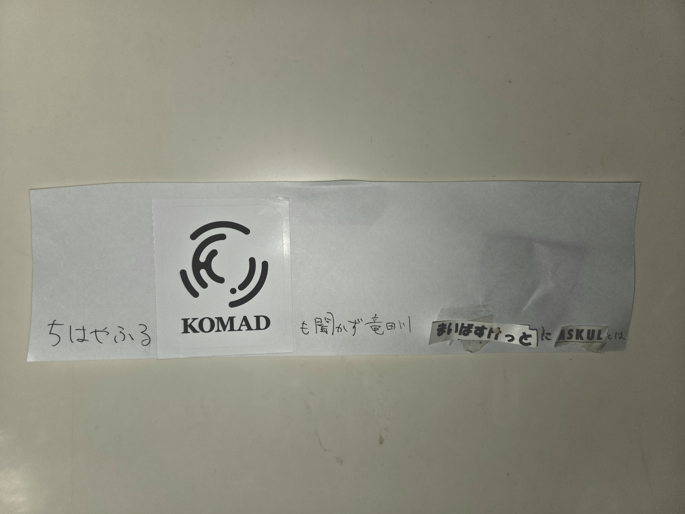
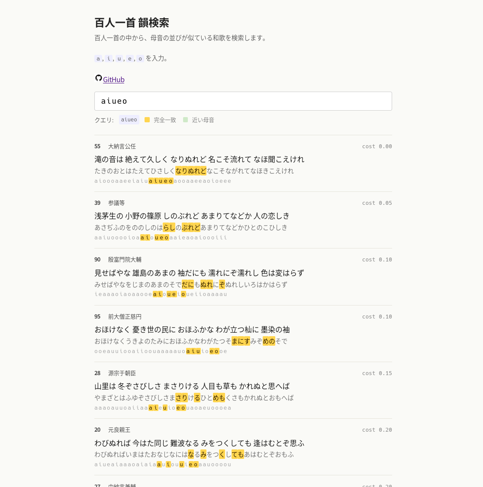

# hyakuninn-rhyme 🍋‍🟩

私が最近居させていただいている、[KOMAD](https://komad.tokyo/)という場所 / コミュニティ はとてもおもしろい。出入りする学生が詩や短歌、ポエムなどをそのへんに書いてたりする。今夜もこんな短歌を見つけた。

ちはやふる KOMAD も聞かず 竜田川 まいばすけっと に ASKUL とは

とくに、最後の「ASKULとは」が好き。字足らずによって生まれる独特なリズム、「水くくる」と微妙に合わないもどかしさ。

KOMADの人はぜひこの短歌がどこにあるのか探してみてください!この近くには他にも粋な(変な？)落書きがあった。

俺もこういう短歌を作ってみたい。そう思って、KOMAD、こまど、と口ずさみながら oao の母音が含まれる百人一首を探すのだが、脳内は全然ヒットしない。

ちょっと調べた感じ、百人一首を母音で検索できるサイトはすぐには見当たらない。これは、検索ソフト作っちゃうか？？そういえばちょうど最近Claude CodeのAPIに試しに5ドル入れたんだった。正直乗り遅れてるから小さいプロジェクトで試してみたかったんだよな。ということで完全vibe-codingで作ってもらったのがこちらである。

[https://ekkekuru2.github.io/hyakuninn-rhyme/](https://ekkekuru2.github.io/hyakuninn-rhyme/)

# ちはやふる KOMADも聞かず 竜田川 まいばすけっとに ASKULとは

いや、KOMADと神代って別に全然韻踏んでねえじゃねえか。アプリ作って機械的に韻を探しても、こういう短歌が書けるようになるわけじゃないんだぜ。そう気づいたときには朝になっていた。
